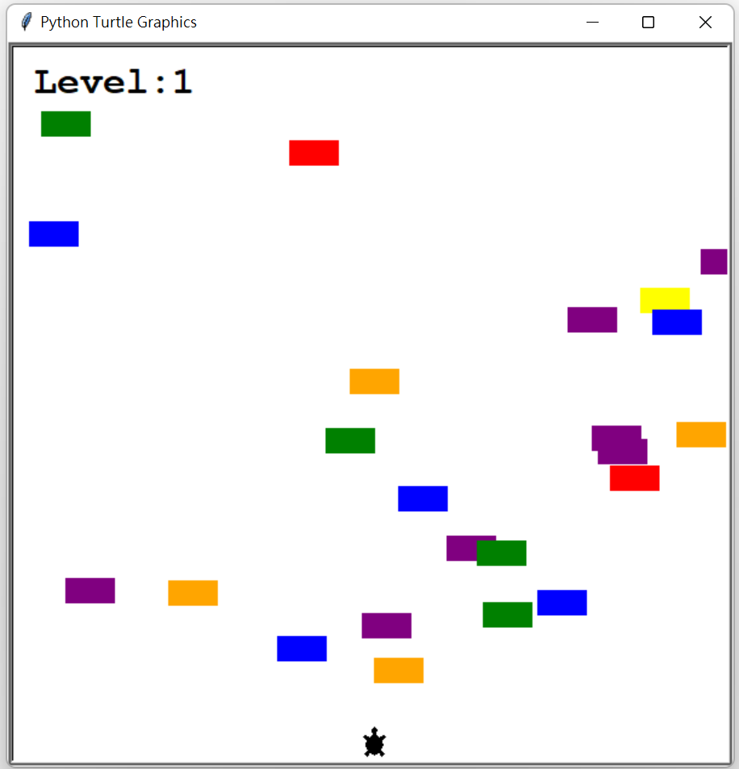
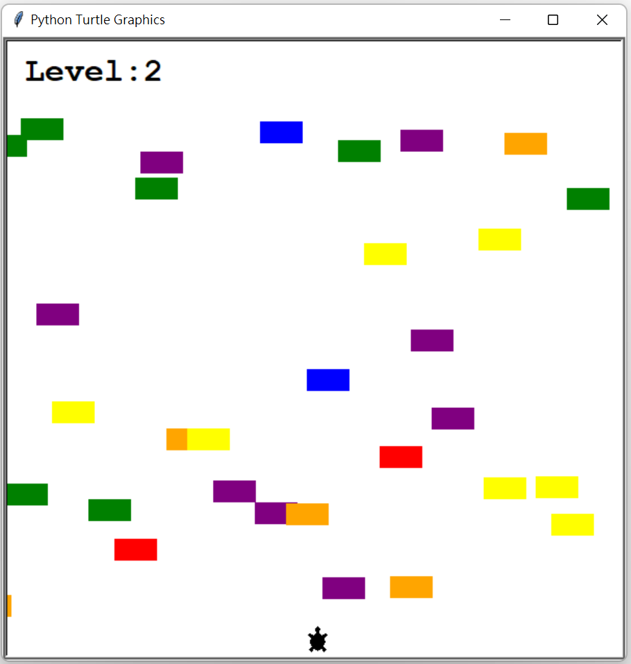
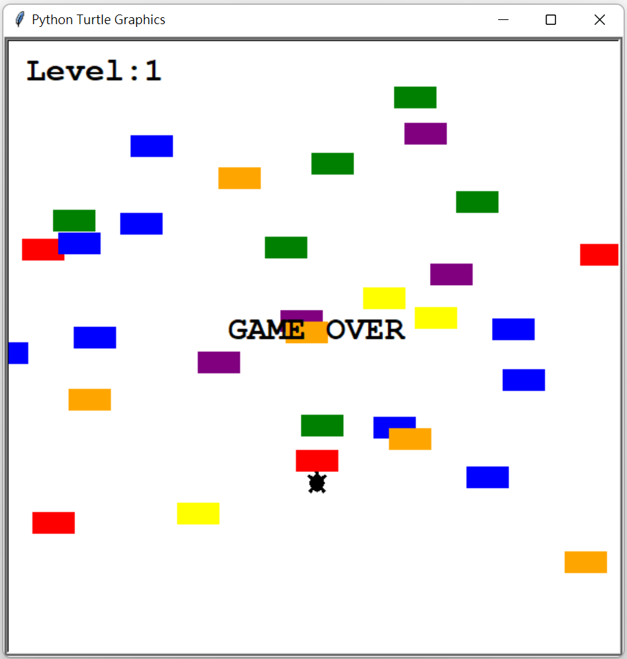

# <Strong>_Description_</Strong>

This game is the same concept with Crossy Road. There have a whole bunch of cars going across a super busy multi-lane highway and the turtle is the player who has to cross the road. 

The player controls the turtle which can only go forwards, and there's a whole bunch of randomly generated cars which are going horizontally across the screen. Once a player reaches the other side of the screen, the cars speed up, but the player goes back to the starting position, ready to cross the screen again. Now, at some point when the player turtle hits a car, then that is game over.

 

# <Strong>_Tools & Git page_</Strong>

 
 
<strong>Git page: **https://github.com/LeonTsai2021 **</strong> 
 

 

# <Strong>_Features_</Strong>

## <Strong>_Home_</Strong>
Press up to play start the game.

## <Strong>_Level up_</Strong>
If the player reach the other side, level up.

## <Strong>_Game over_</Strong>
When turtle hit by the car, game over.

 
